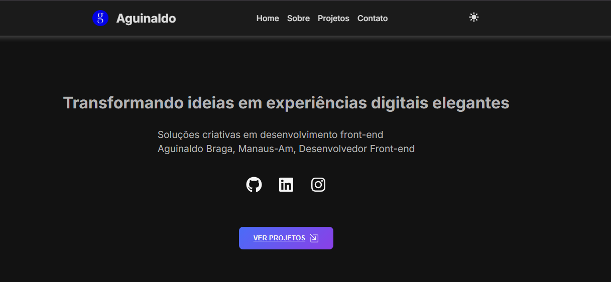

# 🚀 Portfólio de Aguinaldo Braga

Olá! Bem-vindo ao repositório do meu portfólio pessoal. Este projeto é uma vitrine online que apresenta meu trabalho como **desenvolvedor front-end**, minhas habilidades e os projetos que construí.

Acesse a versão ao vivo aqui:
**[Link para o seu portfólio hospedado]**

---

### ✨ Demonstração do Projeto

<br>



<br>


---

### 💻 Tecnologias

Este portfólio foi construído com as seguintes tecnologias modernas, garantindo uma experiência de alta performance e código limpo:


---

### 💡 Funcionalidades Principais

* **Design Responsivo:** O layout se adapta perfeitamente a qualquer dispositivo, de desktops a smartphones.
* **Navegação Suave:** Botões de rolagem com animação que levam os visitantes às seções da página.
* **Componentes Reutilizáveis:** Estrutura modular e organizada, fácil de manter e expandir com novos projetos.
* **Galeria de Projetos Dinâmica:** O portfólio carrega e exibe os projetos a partir de dados, permitindo fácil atualização.
* **Código Limpo e Padronizado:** Uso de **ESLint** e **TypeScript** para garantir a qualidade, padronização e escalabilidade do código.

---

### 🛠️ Instalação e Uso

Para rodar este projeto localmente, siga os passos abaixo:

1.  Clone o repositório para o seu computador:
    ```bash
    git clone (https://github.com/user/seu-repositorio.git)
    ```
2.  Entre na pasta do projeto:
    ```bash
    cd seu-repositorio
    ```
3.  Instale as dependências:
    ```bash
    npm install
    ```
4.  Inicie o servidor de desenvolvimento:
    ```bash
    npm run dev
    ```

---

### 🤝 Contato

Conecte-se comigo!

[](https://www.linkedin.com/in/aguinaldo-braga-ferreira-porfile/)
[](https://github.com/aguinaldobrga)
[](https://www.instagram.com/gui_bragaoficial/)
---

### 🚀 Otimizações e Boas Práticas

Este projeto utiliza a configuração de linter recomendada pelo **Vite + TypeScript**, garantindo código limpo e padronizado.

```js
// eslint.config.js
import reactX from 'eslint-plugin-react-x'
import reactDom from 'eslint-plugin-react-dom'

export default tseslint.config([
  globalIgnores(['dist']),
  {
    files: ['**/*.{ts,tsx}'],
    extends: [
      reactX.configs['recommended-typescript'],
      reactDom.configs.recommended,
    ],
    languageOptions: {
      parserOptions: {
        project: ['./tsconfig.node.json', './tsconfig.app.json'],
        tsconfigRootDir: import.meta.dirname,
      },
    },
  },
])
